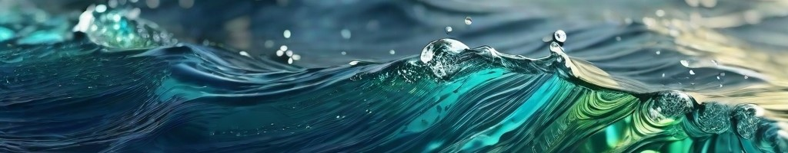

<h1 align="center">Dive into my ocean of code! 
I'm Arnau Ciriquián, crafting digital adventures for web and mobile!</h1>

🦈 I am a graduate in Marine Sciences with a master’s degree in Microbiology, and recently I made a career transition to become a full-stack web developer, even though the timing might not have been perfect, I knew it was the right move for me.

🏴‍☠️ With almost a decade of experience devoted to diverse Marine Science and Microbiology projects, I have developed strong expertise in managing multifaceted projects across various industries, geographical regions, and environmental contexts.

🤙 I consider myself a proactive and creative individual with a strong work ethic, and above all, I thrive in collaborative environments.

🤩 Excited to embrace the challenges and opportunities presented by the tech industry, I am eager to utilize my diverse skill set to make a meaningful contribution to the world of web and gaming development.

<h3 align="left">My tools:</h3>

    

<h3 align="left">Now learning:</h3>

    
